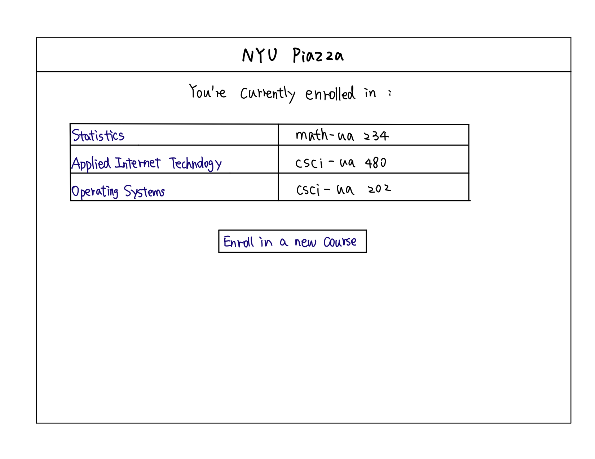
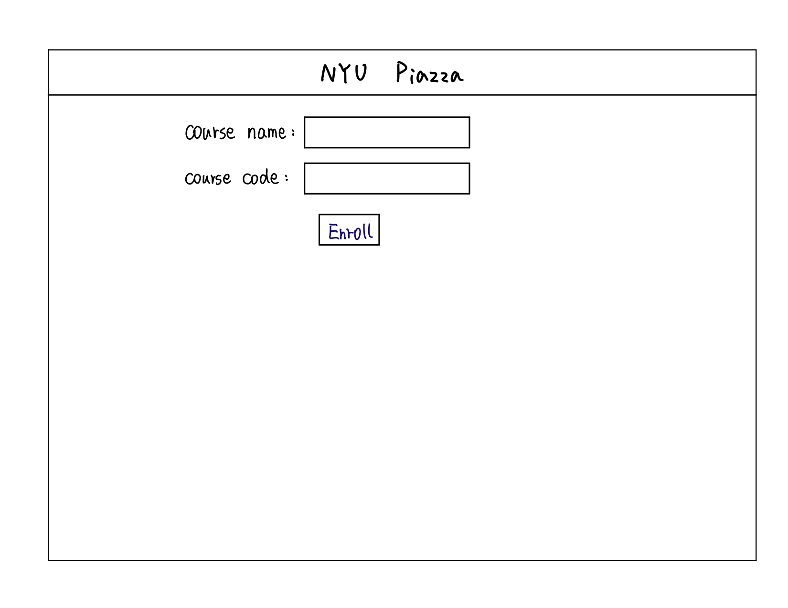
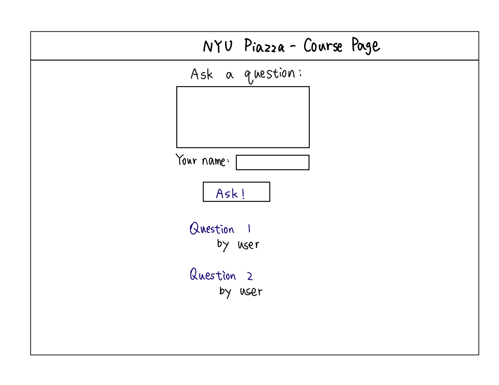
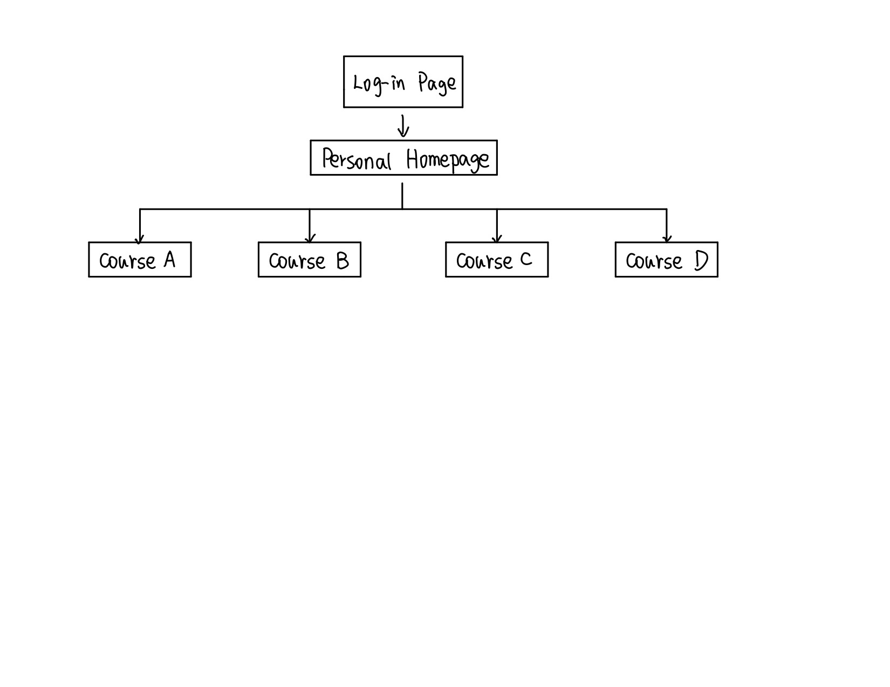

# Mock NYU Classes/Piazza


## Overview

This project is to create a website for students to log in to enroll in classes, get access to classes that they're currently enrolled in, and ask questions which can be answered by other students.


## Data Model

The application will store Students and Courses, as well as questions and answers

* students can enroll in multiple classes (maximum 5 classes)


An Example User:

```javascript
{
  name: "John",
  NetID: "hg1413"
  hash: // a password hash,
  courses: // an array of references to Course documents
}
```

An Example Courses:

```javascript
{
  name: "Applied Internet Technology",
  code: "CSCI-UA 480"
  questions: // an array of questions related to this course
}
```


## [Link to Commented First Draft Schema](db.js) 


## Wireframes

/homepage- personal homepage that shows which course the student is enrolled in



/enroll - page for enrolling in courses



/courseA - course page




## Site map

Here's my site map


## User Stories or Use Cases

1. as non-registered user, I can register a new student account with the site
2. as a user, I can log in to the site
3. as a user, I can enroll in a new course
4. as a user, I can view all of the courses I've enrolled in
5. as a user, I can see and post questions of a course
6. as a user, I can answer questions of a course

## Research Topics

* (5 points) Integrate user authentication
    * I'm going to be using passport for user authentication
* (4 points) Perform client side form validation using a JavaScript library
* (2 points) Use bootstrap and customized theme

11 points total out of 8 required points


## [Link to Initial Main Project File](app.js) 


## Annotations / References Used

1. [passport tutorial](https://medium.freecodecamp.org/learn-how-to-handle-authentication-with-node-using-passport-js-4a56ed18e81e) - [link](https://github.com/nyu-csci-ua-0480-008-spring-2019/goorui-final-project/blob/ec8c63cd5b37111f254cba70a438ad6617f9ebd8/models/Users.js#L12)

2. ["Stuff" Bootstrap theme](https://colorlib.com/wp/template/stuff/)
